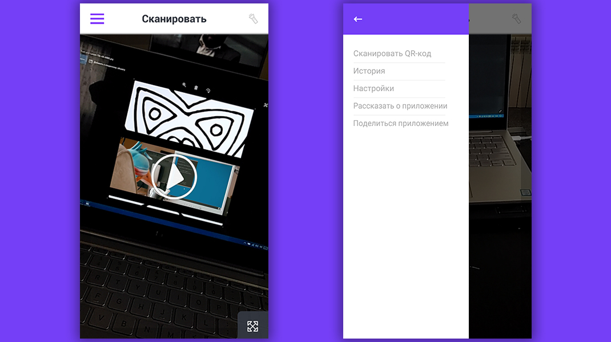
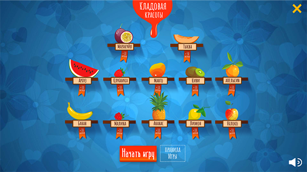
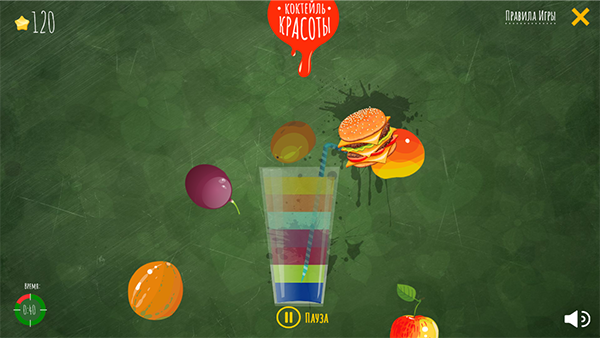

## eXponeta's resume

Sorry, but some project was be marked as _secure by NDA_ because i can't advertise its.

## ARLine

__Try to play__

Coming soon

__Description__

Unity AR application for Android and iOS based on [Vuforia](https://www.vuforia.com/).
It's cloud-based application for showing some Media (Image, Video, etc ) on your markers.

__Role in project__

- Client app developer
- UI-animator

__Screenshots__

## WebGL game [secure by NDA]

__Description__

WebGL mobile-friendly game on [ThreeJS](http://threejs.org). App used [PIXI.JS](http://pixijs.com) for playing Adobe Animate animations via PIXI-Animate library in 3D surface. Game include more that 10 pixi-animate animations and has performance on middle devices.

__Role in project__

- Developer (TypeScript)
- 3D artist for optimizing and adaptation models

__Screenshots__

## Fruit Ninja - like game

__Try to play__ 

[Fruit Ninja Game](http://iexpo.tk/fruit)

__Description__

HTML5 WebGL (Mobile-friendly) based on [PIXI.JS v4](http://pixijs.com). Animations was created on free Spine-like editor [DragonBones](http://dragonbones.com/en/index.html)

__Role in project__

- Developer (JS)
- Animator (DragonBones)
- Designer for animations

__Screenshots__

